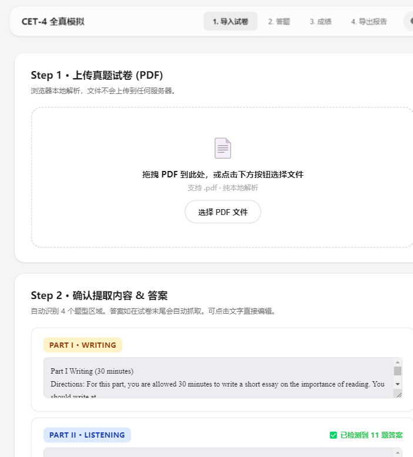
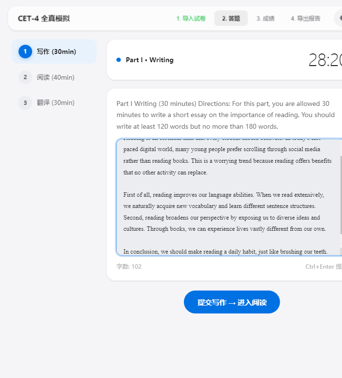
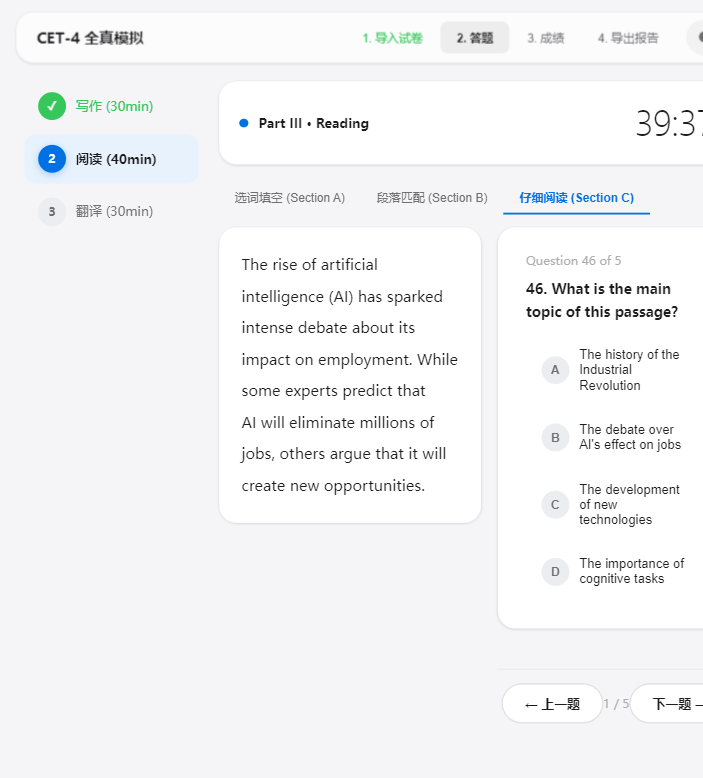
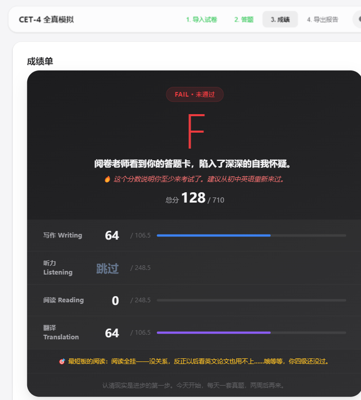
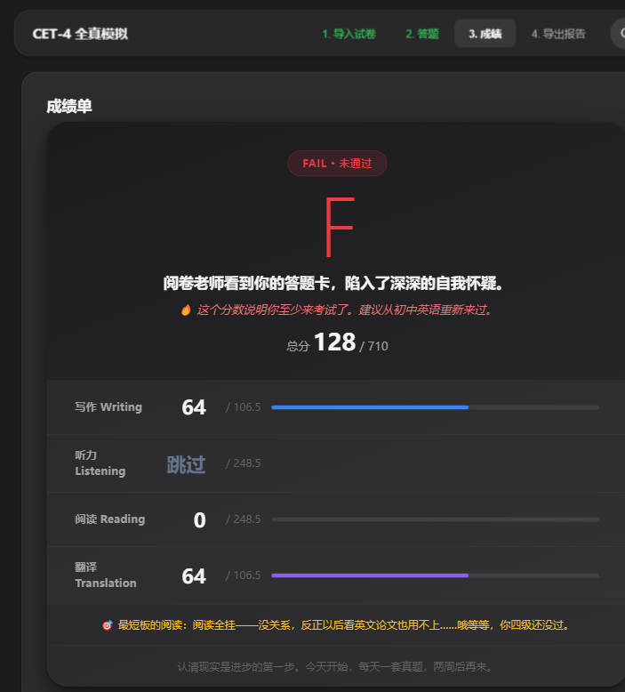

# CET-4 全真模拟考试 v1.1.0

只是一个 HTML 文件，打开浏览器就能用，首次加载 CDN 后无需联网，完全免费。不用装任何东西。不用配置 API Key。**隐私安全**：PDF 不上传服务器，全部在浏览器本地处理。新版换上了 Apple 风格界面，自带深色模式，晚上刷题不刺眼。

## 这个工具是什么

这个工具是我自己备考 CET-4 时写的。市面上没有免费好用的四级模拟软件，要么要付费，要么功能残缺。所以我用了一点时间，把整个考试流程写进了一个 HTML 文件里。

它不能保证你一定能过四级。但它能让你用真题反复模拟，帮你发现自己的薄弱环节，再配合 AI 工具深入分析。每天一套题，两周见效。

## 界面预览

v1.1 重新设计了整套界面。更好的顶栏、深色/浅色一键切换、成绩卡片式展示。

| 导入试卷 | 答题界面 |
|----------|----------|
|  |  |

| 阅读 Section C | 成绩单 |
|:---:|:---:|
|  |  |

## 能做什么

导入一份四级真题 PDF，它会自动提取题目、识别参考答案，然后按照真实考试流程带你走完四个环节：写作 30 分钟 -> 听力 25 分钟 -> 阅读 40 分钟 -> 翻译 30 分钟。时间到了自动交卷。

没有答案也没关系。写作和翻译内置了语法检测引擎，会扫描六类常见错误：冠词、主谓一致、时态、搭配、拼写、Chinglish。阅读和听力如果有答案，可以自动判分。

做完后生成两份报告：一份 DOCX 成绩单，一份 MD 详细报告。MD 报告里包含了所有题目、你的答案和语法错误，直接复制发给 Deepseek 或 ChatGPT，就能得到老师级别的逐题分析。

## 怎么用

1. 下载 `cet4\_exam.html`，用浏览器打开
2. 上传一份四级真题 PDF（比如星火英语的电子版）
3. 确认提取的题目对不对，可以手动改
4. 有听力音频就传，没有就跳过，考试时间会自动缩减
5. 开始考试，按顺序做完四个部分
6. 交卷看成绩，下载报告

## 配合 AI 使用

* **AI 友好**：MD 报告嵌入分析提示词，发出去就能得到专业分析，不用自己描述上下文

## 不足点

* **主观题评分还是有些不准**：写作和翻译的估分基于规则引擎，不是真人批改。语法检测只能发现表层错误（冠词丢了、时态错了），看不出来逻辑问题和表达地道度。分数参考价值其实非常有限，还是需要结合md文件交给AI分析
* **PDF 识别不是 100%**：依赖 PDF.js，遇到双栏排版、扫描件、图片型 PDF 会提取失败。市面上大多数电子版真题是单栏的，问题不大，但预览确认这步一定不能省。
* **没有解析**：客观题只告诉你对错，不解释为什么选这个选项。这部分可以通过 MD 报告 + AI 补上
* **特别注意**：这个工具主要针对桌面浏览器设计，手机上打开排版会挤，勉强能用但不舒服

## 快速体验

如果你手头没有真题 PDF，仓库里提供了示例文件，下载后可以直接走通全流程：

1. 下载 `cet4\_exam.html`、`demo\_exam.pdf`、`demo\_listening.wav` 三个文件，放在同一个文件夹里
2. 浏览器打开 `cet4\_exam.html`
3. 导入 `demo\_exam.pdf`，工具会自动识别四个题型和参考答案。每个 Section 都有中文引导标注，告诉你这里是什么题、怎么答
4. 上传 `demo\_listening.wav` 作为听力音频（10 秒模拟音频，专门用来体验功能）
5. 开始考试，随意作答体验流程。完成后下载 DOCX 成绩单和 MD 报告，把 MD 内容发给 AI 看看分析效果

